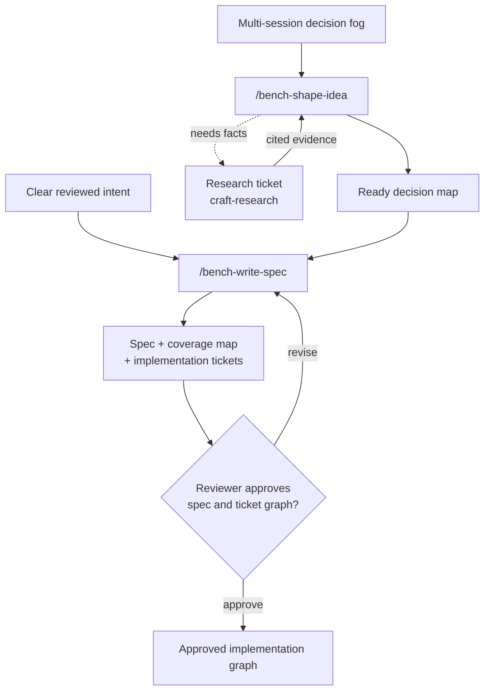
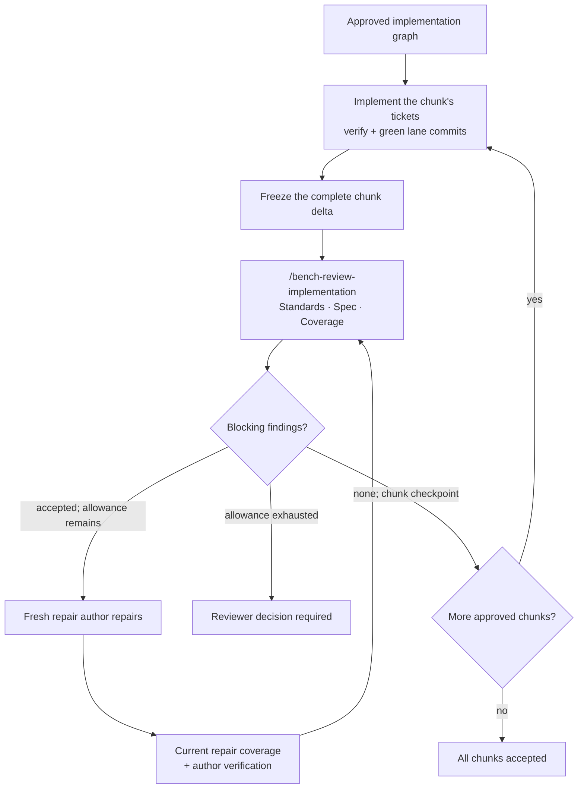
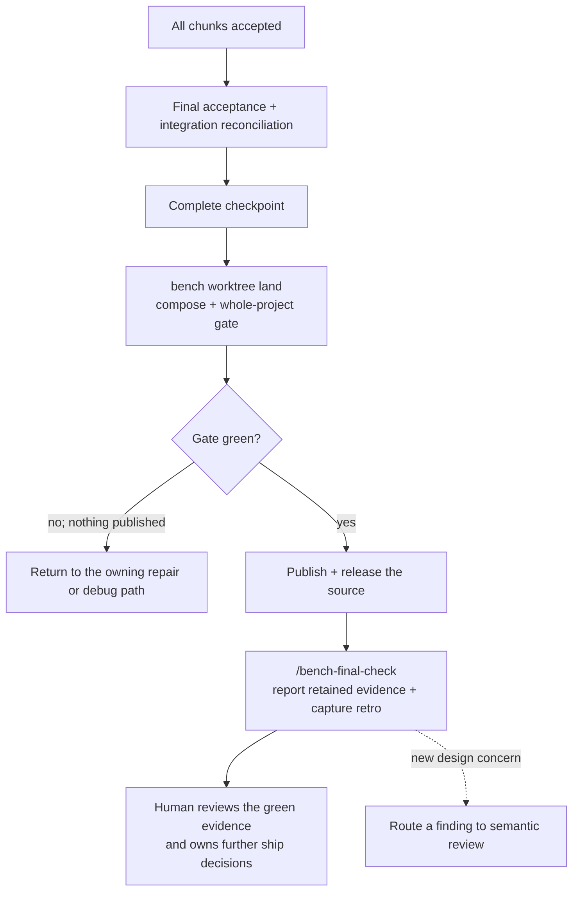
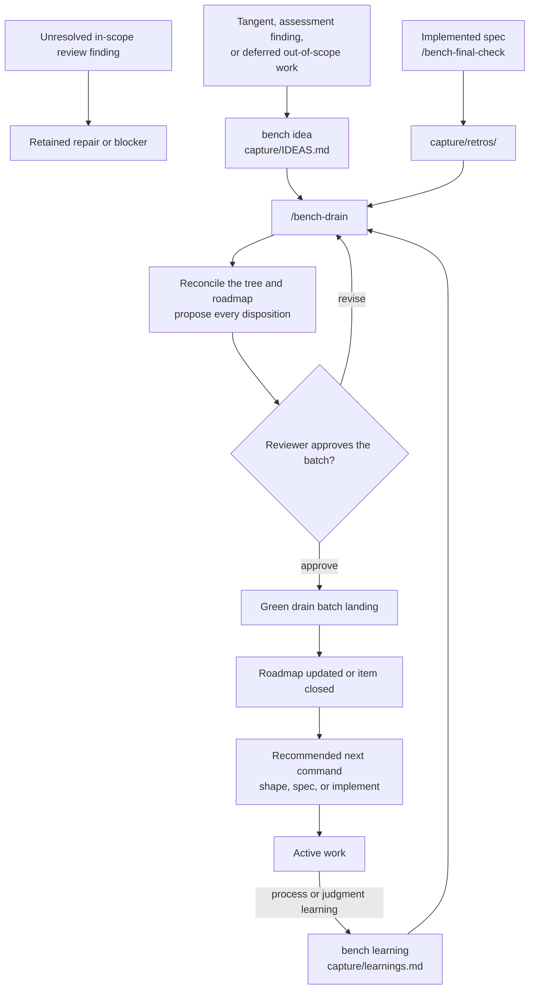

# Bench

A command-first workflow that keeps AI-written code maintainable. Bench turns
intent into small changes, traces affected code, attaches tests at stable
seams, and lets an external gate decide when the work is done.

---

## Reviewer quick start

### Keep AI-written code maintainable

AI can produce working behavior before it produces code that remains easy to
change. Bench makes maintenance part of the task. It asks where behavior
crosses a seam, which code consumes a change, what tests prove it, and where
structure is under pressure.

For example, an agent can copy one pricing rule into checkout and invoicing.
Tests can pass today, while the next discount change spreads across unrelated
files. Reviewers must then prove that both copies still agree.

A **seam** is a stable interface where callers and tests meet. For example, a
scheduler can accept a clock instead of reading system time directly.
Production supplies a real clock, while tests supply a fixed clock. A later
clock change then stays behind the interface, and tests do not patch internals.

You request a Bench phase, and the agent uses the CLI evidence beneath it.
You can also run these commands to inspect the same evidence. Replace the
example path and symbol with values from your repository.

| Question | Command | Maintenance benefit |
|---|---|---|
| Where are possible seams? | `bench outline "internal/gocache"` | Lists symbols and source locations for focused inspection. |
| What can a Go symbol affect? | `bench consumers "gocache.Apply"` | Lists resolved static reference edges and exposes consumers outside the edited file. |
| What does the committed change affect? | `bench consumers --changed --base "<base-commit>" --source-tip HEAD` | Shows consumers of changed declarations between the base and HEAD. Requires a clean checkout. |
| Where is structure under pressure? | `bench structure` | Flags oversized files and crowded directories that need a responsibility check. |
| Which behavior must stay observable? | `bench coverage "<spec>"` | Projects each approved story, behavior, and seam into the implementation work. |
| Does the ticket graph still fit the tree? | `bench preflight build "<slug>"` | Checks the approved artifacts, dependencies, and write fence before implementation. |

`bench outline` locates candidates; it never declares a blessed seam.
`bench consumers` approximates blast radius as potentially affected Go
reference sites. It uses the default build context and cannot see reflection,
plugins, executed programs, other languages, or transitive effects.

If checkout and invoicing call one shared pricing function, the consumer rows
identify both callers for review. Tests can then attach to the pricing seam.
The CLI guides caller and test review; it does not deduplicate the rule.

### See the workflows

Research stays inside the phase that owns the question. It produces cited
facts, while the reviewer retains each product and scope decision.



Each ticket gets a fresh author session. Agent semantic review is
advisory, and it grades a frozen chunk instead of each ticket separately.



Final reconciliation precedes the landing. The landing runs the whole-project
gate. For a reviewed spec, final-check reports the retained landing evidence.



Capture stores deferred work and evidence. An unresolved in-scope finding
remains a repair target or blocker instead of entering the inbox.



`/bench-final-check` reports the retained landing evidence for a spec. It
does not run another gate over an unchanged landed tree.

### Run the workflow

In Claude Code, run Bench as slash commands:

```text
/bench-setup-repo
/bench-shape-idea
/bench-write-spec
/bench-debug
/bench-implement-spec
/bench-review-implementation
/bench-final-check
```

In Codex, invoke the matching adapter skills:

```text
$bench-setup-repo
$bench-shape-idea
$bench-write-spec
$bench-debug
$bench-implement-spec
$bench-review-implementation
$bench-final-check
```

The capture command follows the same pattern: `/bench-drain` in Claude Code
or `$bench-drain` in Codex. Kit maintainers also have
`/bench-update-kit` or `$bench-update-kit`. A linked repository checks for
managed-asset updates with `bench upgrade --check` and applies them with
`bench upgrade`.

Other AGENTS.md harnesses read the matching file under `.agents/commands/` when
they do not expose a native command or skill surface.

For a new repo, ask the agent to run `/bench-setup-repo` or `$bench-setup-repo`.
That phase runs `bench setup` to converge the repo. It then walks you through
the project-specific gate, profile, lines, and an optional `CONTEXT.md`.

Decision maps are situational: `/bench-shape-idea` uses decision tickets only
when reviewer choices form a multi-session dependency tree. The map file is an
index; each decision lives in one ticket file under the map's tickets folder.
It compiles a ready map beside its spec, under `specs/<slug>/decisions/`. A
clear idea may instead authorize `/bench-write-spec` through the
reviewer-confirmed current conversation or a named reviewed artifact.

Spec authoring records exactly one `Decision source:` line. It owns the
engineering seams, coverage, and independently-green implementation tickets.
Implementation starts from that approved ticket graph. The
[implementation command](.agents/commands/bench-implement-spec.md) documents
the end-to-end `--full <spec>` mode and its opt-in `--delegate` extension.
For bugs, use `/bench-debug`; it builds the repro loop first.

Each command orients you at entry. It then hands you off at exit with what
changed, the current artifact or gate state, and the single next command it
recommends. The CLI commands below are the worker and maintainer substrate,
not the reviewer's first operating surface.

---

## How Bench protects maintainability

Planning names the behavior and seam before implementation. Small tickets keep
each change reviewable and green. Review traces consumers beyond the edited
files, and the gate checks the complete result outside the agent's judgment.

Bench combines Matt Pocock's planning pipeline with kunchenguid's isolated
worktrees and gated loop. A declared line selects the model and effort for
each stage. A shift runs bounded agent work in an isolated worktree and commits
only when the gate passes.

---

## Operating guide

The shared working agreement is canonical in `.bench/BENCH.md`: roles,
invariant authority, and workflow proportionality. It also covers
communication rules and how the gate, hooks, skills, commands, and CLI fit
together. README is only the onboarding surface.

Lookup material lives on demand in `.bench/BENCH-reference.md`: the file map,
the generated skills index, and harness invocation forms. It also holds the
category-level CLI notes, the shift adapter contract, and the hook layers.
`bin/bench.sh`, `.bench/hooks/session-start.sh`, and `projects/benchkit.md` are
key entry points. The reference explains their roles.

---

## Worker and maintainer CLI

The reviewer-facing setup path is the setup command above. The worker-facing
mechanics underneath are the `bench` CLI commands here.

**Prerequisites.** Bench runs on macOS or Linux; use WSL2 on Windows. The
source install requires Git and the Node version in
[`package.json`](package.json). It also requires the Go toolchain in
[`go.mod`](go.mod), because `npx` builds the compiled core during install.
Run setup inside a Git repository. If you use a Node version manager, read the
PATH-shim note with the durable-install steps below.

The fastest way for the worker to wire a repo today is one `npx` command
from git. This git-dependency form needs no clone or global install. Replace
`<tag-or-commit>` with an immutable release tag or commit so the cache serves
the expected source:

```sh
cd ~/src/your-project
npx "github:gibbonmi/bench#<tag-or-commit>" setup
```

The `redbench` package is not published, so `npx redbench@<version> setup`
does not work yet. The
[release-readiness status](https://github.com/gibbonmi/bench/blob/main/ROADMAP.md#release-readiness-status)
keeps public release and external deployment at NO-GO pending qualification.
Use the source-development path above only when that status fits your use.

Run from `npx`, `setup` copies the kit in (the npx cache is ephemeral, so it
won't leave dangling symlinks). Prefer to install once and get a durable
`bench` command? Clone the repo, build the core, and symlink the launcher:

That build command is also the one you rerun after you change the Go
sources. Only `scripts/go-build.sh` refreshes the dev build and reseals it, so
a plain `go build` leaves an executable Bench will not trust. In a repository
that declares Go build inputs — the kit itself — `bench worktree land` proves
its own executable before it enforces any landing contract. It refuses with
the exact rebuild command rather than enforcing a contract that has since
been retired. A linked repository declares no build inputs and never pays
that proof.

```sh
git clone https://github.com/gibbonmi/bench ~/src/bench
bash ~/src/bench/scripts/go-build.sh ~/src/bench ~/src/bench/dist/bench
mkdir -p ~/.local/bin
ln -s ~/src/bench/bin/bench.sh ~/.local/bin/bench
cd ~/src/your-project
bench setup
```

A global npm install attempts to place a plain-shell `bench` shim on a stable
PATH directory. The postinstall step is best effort and does not fail the
package install when shim repair fails. Run `bench doctor` and follow its
reported `bench doctor --fix` or PATH instructions.

To uninstall, start with the per-repo footprint: `bench unlink` consumes the
link manifest and reverses the install. It removes the managed files whose
fingerprints still match (including a `CLAUDE.md` that `bench link` itself
created), and prunes emptied managed directories. It also strips the managed
AGENTS.md block while keeping your prose, and removes the bench-managed
pre-push hook.
A file you edited since linking is left in place, as is a `CLAUDE.md` that
predates link (link never records one, even a present-but-empty file). So are
your own artifacts: ROADMAP.md, `roadmap/`, capture/IDEAS.md, CONTEXT.md,
`specs/`, `decisions/`, `capture/learnings.md`, and `.bench/gate.sh`.
Rehearse it first with `bench unlink --dry-run`, which prints the exact plan
and changes nothing:

```sh
cd ~/src/your-project
bench unlink --dry-run   # rehearse: print the removal plan, touch nothing
bench unlink             # remove the per-repo Bench footprint
```

Then remove the global tool — the package and the shim:

```sh
npm uninstall -g redbench && rm -f "$(command -v bench)"
# after npm's own symlink is gone, command -v bench resolves to the shim;
# `bench doctor` prints the machine-exact removal pair while bench still resolves.
```

A repo linked before the manifest existed has nothing for `bench unlink` to
consume, so it exits 1. Remove that footprint by hand (the managed
`AGENTS.md` block, the `.bench/`, `.agents/`, `.claude/`, and `.codex/`
assets, and the pre-push hook).

The reviewer action is the setup phase, not those CLI calls:

```
/bench-setup-repo
# or, in Codex:
$bench-setup-repo
```

The setup phase starts with `bench setup`. That command inspects the Git
repository, previews its inferred facts, and transactionally converges the
managed assets. It also proposes a gate and a starter profile. The phase then
continues into the project-specific work below.

That work explores the repo and walks the reviewer through the gate (the load-bearing
choice) and the profile (seams + lines + design-source path). It also covers
an optional `CONTEXT.md`, one decision at a time, and writes them. The second
half cannot be hardcoded because the gate command, seams, and lines differ in
every repo. So it's an interview, not a script.

`bench link` and `bench init` remain low-level adoption primitives.
`bench link` installs the managed assets, and `bench init` scaffolds a
fail-closed gate. Use them when you intentionally need the mechanical steps
outside `bench setup`.

`bench link` is idempotent and harness-neutral. It preserves project-owned
files, adds or updates only the managed Bench block in `AGENTS.md`, and
installs the full guide at `.bench/BENCH.md`. It also copies portable skills
and commands into `.agents/`, and installs Claude and Codex hook adapters
that call shared `.bench/hooks/` scripts. It installs a local hook CLI set
under `.bench/bin/`, and installs a git `pre-push` guard.

Copy mode is the default. Use `bench link symlink` only when you intentionally
want a dogfood repo to follow live edits in a central kit checkout. If a project
already owns a same-named skill, command, or pre-push hook, `bench link` fails
with a conflict report
instead of overwriting it. If you copy `bench` somewhere by hand, set
`BENCH_KIT=/path/to/kit`.

## Migrating from Matt Pocock's skills

If a repo is already set up with Pocock's engineering skills, you're most of
the way there. Bench builds on the same substrate, so adopt what's there
rather than restarting. `bench link` won't clobber an existing `CONTEXT.md`,
`docs/adr/`, or project-owned `AGENTS.md`. It appends or replaces only the
managed Bench block, and adds Bench's portable skills and commands alongside
non-conflicting project assets. It also writes the `CLAUDE.md` imports when
absent (retrofitting only the exact file an older link wrote); an edited
`CLAUDE.md` is project-owned and stays untouched.

The pieces line up directly. Bench reads a Pocock `CONTEXT.md` as-is because
both workflows use that file for cold sessions. The `craft-adr` skill already
writes to `docs/adr/`, so your decision records carry over untouched. Where
Pocock's `setup-matt-pocock-skills` recorded an issue
tracker and domain layout under `docs/agents/`, `/bench-setup-repo` reads
those if present and won't re-ask.

What Bench adds on top is the part Pocock's skills leave to you. It adds the
**gate** as an external oracle (`.bench/gate.sh`) and the **gated shift
loop** that commits only on green. It also adds the **declared line**
(model + effort) per run, and the **profile** (`projects/<name>.md`) that
names the seams.

For migration, ask the agent to run `/bench-setup-repo`. It confirms the
link/init mechanics, detects the existing Pocock structure, and reuses it.
It only asks for the things Bench introduces (the gate command, the seams,
the lines). Nothing about Pocock's planning flow is replaced; Bench wraps it in
enforcement it didn't have.

## Keeping Bench current

In a linked repository, run `bench upgrade --check` to inspect managed-asset
changes. Run `bench upgrade` to relink onto the installed kit version.

Kit maintainers use `/bench-update-kit` or `$bench-update-kit` to compare
Bench with its upstream sources. The command proposes adoptions and runs three
quality loops before anything ships.

The first loop is anti-sediment (`craft-skills`: does
the change earn its place or just enlarge the kit?). The second is a
consistency audit (re-grep for stale references, invariant drift,
app-specific leakage). The third is the dogfood loop — a real shift on a
real repo with the changed kit. It is the only loop with the authority to
actually accept a change. It respects closed decisions: something Bench
already rejected isn't re-litigated unless the upstream version materially
changed. It proposes; you own the merge.

## Switching harnesses

`bench link` wires every supported harness to the same portable
`.agents/{skills,commands}` content. You can switch harnesses without changing
the repository. Read the Harness Invocation section in
`.bench/BENCH-reference.md` when you need a harness's phase syntax or adapter
details. The pre-push hook protects the branch it resolves, whichever harness
or human pushes; `git config bench.allowProtectedPush true` lifts that
protection for one repository.

Env knobs: `BENCH_AGENT` (required for `bench shift` — a harness adapter
executable that reads the prompt from stdin; reference adapters ship in
`.bench/adapters/`), `BENCH_MAX_ITERS`, `BENCH_GATE` (a gate command if you'd
rather not ship `.bench/gate.sh`).

---

## Workflow

The workflow contract is canonical in `.bench/BENCH.md`. Use the quick-start
path above as the reviewer surface. Then read the guide for when to shape,
spec, implement, review, final-check, debug, or run an autonomous shift.

---

## The design system as a visual oracle

A UI project's design system lives in its own repo and plugs in as the
**visual oracle**. That's the third gate axis, after tests (behavior) and
the screenshot loop (interaction). The project consumes it as a submodule,
package, or pinned path. The `craft-design-system` skill makes the agent
consume it rather than reinvent it: every value references a token, and
every component composes from the inventory. The design-conformance check
fails the build on raw hex, hardcoded spacing, or a duplicated component.

For a UI shift the gate's green suite is necessary but not sufficient. Route
UI shifts to a mid line; the screenshot loop, not raw model strength, is what
catches the failures there.

The handoff is repo-to-repo, which is what makes it harness-agnostic. When a
shift needs a token or variant that doesn't exist, you add it in the design
repo. Do that via Claude Design when you're in a Claude session, or by
editing the repo directly under Codex or any other harness. Then commit,
re-pin, and build against it. Nothing in the UI workflow depends on which design tool or which
agent you're using; it depends only on the committed artifacts.

## Example profile: gl-axi

[`projects/gl-axi.md`](projects/gl-axi.md) is a shipped example profile, not
evidence of a live integration. It shows how the `craft-cli` skill and an AXI
conformance gate can hold a CLI to an external standard.

```sh
cd ~/src/gl-axi
# the gate runs three oracles in order of authority:
#   pytest                 — behavior at the output boundary + glab adapter seams
#   axi-conformance        — TOON stdout, minimal schemas, structured errors, exit codes
#   bench-glab-delta       — your paired per-task harness vs raw glab, deterministic asserts
#
# add a new command wrapper — cheap line, it's mechanical once the boundary exists
bench shift "add 'mr list' wrapper emitting TOON per the craft-cli skill, with a conformance test"
```

The conformance check and your paired-delta harness are deterministic
assertions (a TOON-shape check is a parser, not a model). Because of that,
the loop can't pass by fooling a judge. A shift that makes gl-axi worse than `glab` on any task
fails the gate and never commits. That's invariant #1 pointed directly at
the tool you're building.

---

## Where each piece came from

| Bench piece | Pocock | Kun Chen | Your discovery |
| --- | --- | --- | --- |
| `/bench-shape-idea`, `/bench-write-spec`, `/bench-implement-spec`, `/bench-review-implementation`, `/bench-final-check` | decision-mapping, research, to-prd, implement, review | — | — |
| Bench craft skills | codebase-design, tdd, grilling, writing-great-skills | AXI spec | generated skills index in `.bench/BENCH-reference.md`; stateless-reader docs; effort, review, delegate, gate, and design guidance |
| `bench worktree` | — | treehouse | — |
| `bench shift` (gated loop) | — | gnhf + no-mistakes | gate-on-green, not self-graded |
| `/bench-setup-repo` (configure a repo) | setup-matt-pocock-skills | — | gate + profile + lines, interviewed |
| `/bench-update-kit` (sync upstream) | — | — | re-run the synthesis vs upstream, 3 loops |
| `/bench-drain` (reconcile roadmap, drain capture) | — | — | the kit learns from its own use, one reviewed batch diff |
| `/bench-debug` (bug path) | diagnosing-bugs | — | repro loop as the bug's gate |
| `/bench-deepen` (deepening survey) | improve-codebase-architecture | — | scopes from `ASSESSMENT.md` findings; vocabulary charged from `craft-seams`, grilling from `craft-grill`; mid-tier read-only delegate |
| design-it-twice in `craft-seams` | codebase-design | — | high-effort line at the uncertain seam |
| `bench shift` `.bench-notes.md` | — | gnhf (iteration context) | — |
| `block-dangerous-git.sh` | git-guardrails | — | agent has no destructive authority |
| `block-primary-file-write.sh` | — | — | main receives writes only through landings |
| Stop hook + `.bench/gate.sh` | — | no-mistakes (external gate) | the gate is the oracle |
| The line declaration | — | — | "suggest model and effort" |

The combination is more than the parts. Pocock's pipeline gives the shift a
real target (seams and stories chosen up front). Kun Chen's substrate
gives the target real teeth (an isolated, gated, autonomous loop). Your
invariants decide that when the agent's judgment and the gate disagree, the
gate wins. That single rule makes an autonomous loop safe to leave running.
