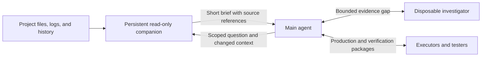

# Codex workflow: companion research

Recommendation: Assess the companion as an addition to the selected retained-author workflow, using the existing benchmark evidence and staged assessment spec.
The sources describe a plausible way to reduce main-agent context load.
They do not isolate the companion's effect on cost, speed, or quality.

Status: Initial source review; follow-up research is parked
Retrieved: 2026-09-11
Scope: Companion contract, orchestration boundaries, and published benchmark evidence
Consumed by: The existing benchmark-orchestration decision map and workflow-assessment spec; links below
Drift: Recheck when the related worktree, upstream role contracts, benchmark evidence, or the target harness changes
Retire when: A controlled experiment supplies a decision, or the reviewer closes the idea

## Existing Bench work: start here

The completed FT311 benchmark set already examines implementation topology, context retention, model choice, review quality, and complete workflow cost.
The [four-run comparison][bench-comparison] records delegated Astra, Terra, and Sol runs, plus solo Astra.
The [subsequent independent comparison][bench-review] owns the corrected Astra findings.
Its findings supersede earlier clean-candidate claims.

The related worktree is `benchmark-orchestration-shape`.
Its [ready decision map][bench-map] connects the benchmark evidence to four staged specs.
The two closest consumers of this research are:

- [Retained implementation workflow][bench-workflow]: the selected authorship and independent chunk-review approach.
- [Workflow assessment][bench-assessment]: complete cost and quality records, comparison controls, and later adoption evidence.

The sibling specs cover implementation continuation and completion evidence.
Resolved map tickets own the selected policies; the [benchmark recommendations][bench-recommendations] preserve historical evidence and proposals.
Use those sources directly instead of treating the external workflow as a new orchestration decision.

Observed: 2026-09-11
Worktree branch: `bench/assign/ce8853ba95d83532380a0580f5297d1a/42976835b76775651ce813f037d5c551`
Worktree commit: `57fb766d58954a603b51d521ddcd203db4764441`
Spec status: Both linked specs say `staged`; the worktree also contains uncommitted implementation edits

### Implication for the companion question

The remaining question is whether a persistent context assistant improves the selected retained-author workflow.
The existing FT311 runs do not isolate that capability.
They also have unequal assurance and other comparison limits. [Benchmark limits][bench-comparison]
Preserve the selected authorship and review decisions when assessing the companion.
Use the assessment spec's complete accounting and trial contract for any proposed comparison. [Assessment decisions][bench-assessment]

## Sources and local copies

Both repositories have shallow local clones under `~/workspace/`.
The OCR clone includes both experiment branches.
All upstream citations below pin the retrieved commits.
The review did not install the workflow or execute either repository's code.

| Repository | Local directory | Revision |
| --- | --- | --- |
| Workflow, version 1.1.17 | `~/workspace/codex_workflow` | `6d9b06f73bee7f899001b0bb102c70529a24313f` |
| OCR baseline | `~/workspace/OCR_workflow_variants` | `1d8f48fcc0d91ba81be3010b321f39105791e68b` |
| OCR `experiment/sol` | Same clone, remote branch | `eaf2fa53ca27bf3eb969a963fe7293819eb0a6b9` |
| OCR `experiment/astra` | Same clone, remote branch | `e0f64e2c5a9e55168c4b2722f3e03babd59eac29` |

## Q1. What is the companion pattern?

### Facts

The companion is one persistent, read-only worker for a workflow session.
Its configuration specifies Luna with `xhigh` effort.
It retains supporting project context and returns concise briefs with exact references.
Its tasks include log analysis, dependency inventories, contract indexes, and checks for conflicting evidence. [Companion contract][companion]

The main agent supplies a task identifier, context scope, goal, and guidance.
Follow-ups carry the identifier and changed context only.
The companion must recheck mutable facts when freshness matters.
Reports have a 220-word limit; decision-changing interim updates have a 100-word limit. [Companion contract][companion]

The companion cannot implement, allocate workers, decide architecture, accept results, or communicate with the user.
It retains detail in its thread; durable project documents provide separate session continuity.
An Investigator handles a bounded evidence gap, including research beyond the local project ecosystem. [Role boundaries][roles]

The Heavy route assigns production to Executors and independent verification to Testers.
The Medium route keeps implementation and verification with the main agent.
Both require one companion for substantive work, and both retain main-agent decision authority. [Heavy route][heavy], [Medium route][medium]

### Inference

The useful pattern is a reusable context service with a narrow authority boundary.
It can keep bulky supporting evidence outside the main conversation.
Its value depends on reuse and avoided reads, because the companion also accumulates context costs.
The source explicitly discourages tiny lookups, repeated summaries, and status-only requests. [Context guidance][roles]

## Q2. What do the benchmarks establish?

### Facts: OCR workflow variants

The supplied benchmark preserves a baseline and two Heavy-route application upgrades.
The README labels the runs Sol `xhigh` and Astra `high`.
The shared prompt requests UI changes, multiple images, OCR layout preservation, web search, and GPU-backed vision. [Benchmark README][ocr]

The comparison image includes token tables for both runs.
Both tables contain one companion, so neither run provides a companion-free control. [Comparison image][comparison]

| Screenshot measure | Sol run | Astra run |
| --- | ---: | ---: |
| Companion rollouts | 33 | 13 |
| Companion input tokens, including cached input | 3,131,881 | 602,496 |
| Companion output tokens | 10,145 | 3,178 |
| Main-agent rollouts | 332 | 367 |
| Displayed elapsed time | 4h 22m 22s | 57m 12s |

These values are manual transcriptions of the published image, not measurements from this review. [Comparison image][comparison]
The current token-report contract includes cached tokens within input tokens; adding those columns would count cached tokens twice. [Report contract][report]

The Sol branch includes browser screenshots and a JSON report with empty error arrays for its recorded desktop and mobile checks. [Sol browser evidence][sol-evidence]
Its handoff states that local tests remain ignored.
The Astra handoff cites ignored acceptance evidence and a clean-build limitation involving baseline Jetson artifacts. [Sol handoff][sol-handoff], [Astra handoff][astra-handoff]

### Facts: separate older light benchmark

The workflow repository also contains a different comparison: no workflow, old workflow, and new workflow.
Its chart reports $16.61 and 38 minutes without the workflow, versus $4.63 and 78 minutes with the new workflow.
The new workflow's displayed token totals sum to approximately 71.28 million, versus 26.11 million without the workflow. [Older chart][light-chart]

The chart changes main-agent effort from `high` to `xhigh` and uses 13 Luna workers in the new run.
The Heavy contract targets main-agent turns and context consumption; it explicitly excludes aggregate subagent tokens from its optimization target. [Older chart][light-chart], [Heavy target][heavy]

### Inference and evidence limits

The older chart suggests a trade between expensive main-agent usage, cheaper worker usage, and elapsed time.
It does not establish a reduction in total tokens or a causal benefit from the companion.
The OCR comparison also changes the main model, effort, worker mix, and resulting implementation.
Neither comparison isolates the companion pattern.

This review found no committed raw session traces, repeated trials, or companion-only experiment in the inspected upstream branch inventories.
The displayed costs remain author-reported; this review did not validate prices or subscription accounting.
Screenshots and handoffs support inspection, but they do not establish reproducible functional equivalence.

## Q3. Which boundaries need further research?

### Facts and unresolved differences

The workflow requires the main agent to read the complete project-document framework once during session intake.
It then routes suitable freshness checks and larger context requests to the companion.
Thus, the design still incurs an initial main-agent document read. [Intake contract][roles]

The breakdown describes an earlier report-collection design that could not receive worker reports directly.
The current Heavy contract makes the main agent coordinate every worker directly.
Treat the earlier platform limitation as an upstream observation that needs a harness-specific probe. [Earlier design][history], [Current topology][heavy]

The OCR baseline's instructions assign closing progress and session-document updates to the Archivist.
Current Heavy instructions assign those documents to the main agent.
This contract difference prevents treating the OCR snapshots as an exact demonstration of all current workflow rules. [OCR instructions][ocr-agents], [Current ownership][heavy]

### Proposals and follow-ups

- [ ] Recover the exact workflow release, role settings, and sanitized session traces for each OCR run.
- [ ] Audit the token totals against raw records, report cutoffs, and dated model prices.
- [ ] Obtain the omitted tests, acceptance evidence, and Jetson prerequisites before attempting an OCR reproduction.
- [ ] Probe companion reuse, message delivery, context compaction, and recovery in each intended Bench harness.
- [ ] Test stale evidence after a source edit, conflicting worker reports, and a companion thread that loses useful context.
- [x] Locate the completed FT311 comparisons, ready decision map, and related staged specs in the active worktree.
- [ ] Assess the companion against the selected retained-author workflow and existing context surfaces before proposing another experiment.

## Verification record

- [x] Inspected pinned role files, routes, benchmark instructions, branch inventories, handoffs, and the Sol browser report.
- [x] Viewed both comparison images and checked the current token-report semantics against its parser.
- [x] Separated source facts, inferences, and proposals; retained the ownership difference and unknowns.
- [x] Linked material claims and described the authority relationships.
- [x] Recorded the retrieval date, refresh triggers, and consuming assessment.
- [x] Tested results: no workflow run, OCR deployment, cost reproduction, or harness compatibility probe occurred.

## Validation plan

Start with the existing FT311 evidence and workflow-assessment contract.
Identify a companion-specific evidence gap before proposing further paid trials.
Use the assessment spec's approved-plan and held-out-task requirements.
The following comparison is a candidate within that contract, not a new trial authorization.

Use a repeatable task with substantial supporting context.
Hold the main model, effort, worker allocation, prompt, tool access, and acceptance checks fixed.
Compare the selected retained-author workflow with disposable context support and persistent companion support.
Keep request batches comparable across arms, and repeat each arm with a recorded initial state.

Measure accepted outcomes, missed constraints, stale claims, repair rounds, main-agent turns, and elapsed time.
Record uncached input, cached input, output, and dated cost separately for each role.
Include initialization and closure costs.
Require equivalent acceptance results before interpreting a cost reduction as an improvement.

[companion]: https://github.com/viettran-edgeAI/codex_workflow/blob/6d9b06f73bee7f899001b0bb102c70529a24313f/codex_workflow/agents/companion.toml
[roles]: https://github.com/viettran-edgeAI/codex_workflow/blob/6d9b06f73bee7f899001b0bb102c70529a24313f/workflow_breakdown.md#53-companion-versus-investigator
[heavy]: https://github.com/viettran-edgeAI/codex_workflow/blob/6d9b06f73bee7f899001b0bb102c70529a24313f/codex_workflow/heavy_route.md
[medium]: https://github.com/viettran-edgeAI/codex_workflow/blob/6d9b06f73bee7f899001b0bb102c70529a24313f/codex_workflow/medium_route.md
[ocr]: https://github.com/viettran-edgeAI/OCR_workflow_variants/blob/1d8f48fcc0d91ba81be3010b321f39105791e68b/README.md
[comparison]: https://github.com/viettran-edgeAI/OCR_workflow_variants/blob/1d8f48fcc0d91ba81be3010b321f39105791e68b/result_copmaring.png
[report]: https://github.com/viettran-edgeAI/codex_workflow/blob/6d9b06f73bee7f899001b0bb102c70529a24313f/codex_workflow/skills/deployment-token-report/SKILL.md
[sol-evidence]: https://github.com/viettran-edgeAI/OCR_workflow_variants/blob/eaf2fa53ca27bf3eb969a963fe7293819eb0a6b9/verification_artifacts/VER-07-final-report.json
[sol-handoff]: https://github.com/viettran-edgeAI/OCR_workflow_variants/blob/eaf2fa53ca27bf3eb969a963fe7293819eb0a6b9/agent_docs/latest_session_work.md
[astra-handoff]: https://github.com/viettran-edgeAI/OCR_workflow_variants/blob/e0f64e2c5a9e55168c4b2722f3e03babd59eac29/agent_docs/latest_session_work.md
[light-chart]: https://github.com/viettran-edgeAI/codex_workflow/blob/6d9b06f73bee7f899001b0bb102c70529a24313f/light_benchmark/analysis.png
[history]: https://github.com/viettran-edgeAI/codex_workflow/blob/6d9b06f73bee7f899001b0bb102c70529a24313f/workflow_breakdown.md#1-the-original-explorer-companion-idea
[ocr-agents]: https://github.com/viettran-edgeAI/OCR_workflow_variants/blob/1d8f48fcc0d91ba81be3010b321f39105791e68b/AGENTS.md
[bench-comparison]: /home/mgibs/workspace/bench/capture/benchmarks/ft311-recoverable-reset-20260910/comparison-four-arms.md:55
[bench-review]: /home/mgibs/workspace/bench/capture/benchmarks/ft311-recoverable-reset-20260910/comparison-astra-code-review.md:1
[bench-map]: /home/mgibs/.bench/worktrees/bench-2826441890/ce8853ba95d83532380a0580f5297d1a-42976835b76775651ce813f037d5c551/specs/retained-implementation-workflow/decisions/benchmark-orchestration.md:21
[bench-workflow]: /home/mgibs/.bench/worktrees/bench-2826441890/ce8853ba95d83532380a0580f5297d1a-42976835b76775651ce813f037d5c551/specs/retained-implementation-workflow/spec.md:7
[bench-assessment]: /home/mgibs/.bench/worktrees/bench-2826441890/ce8853ba95d83532380a0580f5297d1a-42976835b76775651ce813f037d5c551/specs/workflow-assessment/spec.md:64
[bench-recommendations]: /home/mgibs/.bench/worktrees/bench-2826441890/ce8853ba95d83532380a0580f5297d1a-42976835b76775651ce813f037d5c551/specs/retained-implementation-workflow/decisions/benchmark-orchestration/assets/benchmark-recommendations.md:11
