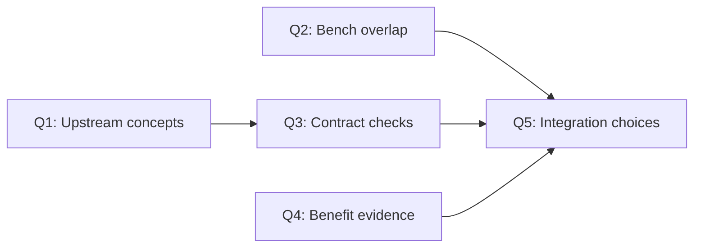
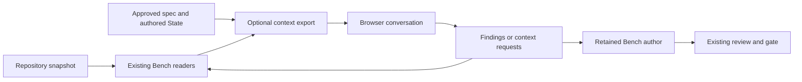

# AI Badger assessment for Bench

## Recommendation

**Borrow selected context-design ideas. Keep aibadger optional until a controlled trial proves value beyond current Bench.**
The strongest candidate is repository orientation that identifies package roles, entry points, configuration, and documentation.
Its current map omits important Bench guidance and promotes fixtures. It does not qualify as Bench's default orientation source.

This assessment covers concepts, source contracts, integration opportunities, and local probes. It proposes changes; it does not approve adoption.
Evidence includes direct source inspection, four passing upstream package suites, and executable probes.
No paid model comparison or end-to-end Bench integration ran.

Retrieved: 2026-09-14, America/New_York; the GitHub API inspection also spans 2026-09-15 UTC
Upstream: `PVRLabs/aibadger` at `fadba60af386fe88efe700fee8c4244b106a2894`
Bench baseline: `984bdacfe0c67d8fb4a3cc994a122b50008a1a39`, branch `main`
Consumed by: Bench integration decisions and a possible controlled context experiment
Drift: Refresh after changes to either project's context, review, handoff, or assessment contracts.
Retire when: An approved decision incorporates or rejects these proposals.
Source branch: `bench/assign/39db15f7bdadf0d85c2f28217746882c/f490fe7102302efd345b486a3556e00a`
Source tip: `d240bd0ea61dbf4c262b1d0991436ccea7d5f5bb`
Roadmap owner: FT346

## Question graph

Q1 establishes upstream capabilities. Q2 establishes Bench overlap. Q3 tests compatibility risks. Q4 evaluates benefit claims. Q5 combines the answers into proposals.

## Q1. What concepts does aibadger implement?

### Facts

Aibadger prepares context for an external AI conversation. Its main flow separates a project map, requested source extraction, and reviewed file application.
For agents with direct repository access, upstream recommends initial topology only when useful, followed by native tools. [U1][U2]

| Concept | Mechanism | Practical value |
|---|---|---|
| Progressive disclosure | A metadata map precedes source requests. | Orient before broad source reads. [U1][U2] |
| Repository roles | Language detectors identify modules and source roots. Separate scans add documentation and operational resources. | Describe more than symbol locations. [U3] |
| Simple selectors | `FILE`, `PREFIX`, and `NEAR` request complete files or heuristic spans. | Let browser conversations request additional context. [U2] |
| Review budget | Preserve the authoritative diff. Add optional complete files within byte limits. | Protect required evidence from optional context pressure. [U5][U6] |
| Supplemental review | Add requested context without repeating the initial diff. | Reduce duplicate context in later exchanges. [U5] |
| Session handoff | A compact conversation summary precedes separate repository context collection. | Give session intent and repository facts separate producers. [U7] |
| External context | A configuration file names additional read-only directories. | Include shared documentation without making it an edit target. [U8] |
| Local API | Explicit roots, caller-owned inputs, text output, and no provider call. | Support editor or script integration. [U5] |

The topology is heuristic. It does not resolve dependency edges or perform task-conditioned semantic search.
Representative-file selection uses category priority, file size, and path order. Language-specific detectors add their own priorities. [U3][U9]

The supported CLI API emits AI-facing text, without a stable structured topology or extraction-metadata interface.
The public Go facade imports interactive configuration. Its module includes terminal-interface dependencies. [U5][U10][U16]

### Inference

The useful principle is to prepare the smallest useful next view.
Browser transport adds most value when the receiving model lacks repository tools. Upstream's own agent guidance supports that distinction. [U1]

## Q2. What does Bench already provide?

### Facts and comparison

Local citations refer to the pinned Bench baseline.

| Need | Existing Bench owner | Remaining opportunity |
|---|---|---|
| Compact discovery | `bench outline` provides directory counts and scoped file:line symbols. | Add package roles where they improve discovery. Source: `internal/outline/outline.go:1`, `:80`, `:235`. |
| Go reference evidence | `bench consumers` resolves references and emits citation identity. | A topology map cannot replace resolved edges. Source: `internal/consumers/command.go:101`, `internal/consumers/citation.go:15`. |
| Review subject | Bench fixes review boundaries and checks the approved spec. | A browser export could compose these existing owners. Source: `.bench/BENCH.md:125`, `projects/benchkit.md:38`. |
| Session continuity | `bench handoff` derives facts and preserves authored State. | Reuse State for a disposable external export. Source: `internal/handoff/handoff.go:157`, `internal/handoff/facts.go:63`. |
| Cost and quality evidence | `bench assessment` stores attributed usage, time, quality, and comparison plans. | Measure the candidate through this owner. Source: `internal/assessment/README.md:1`, `:98`. |
| Retrieval experiment | FT240 already proposes three arms for the separate `iq` candidate. | Reuse its evaluation precedent without changing its approved arms. Source: `roadmap/FT240.md:1`. |

Bench already separates generated repository facts from authored judgment in its handoff implementation.
A second permanent summary would duplicate an existing owner. Source: `internal/handoff/handoff.go:157`.

Bench also requires one source per fact and portability across harnesses.
Those constraints remain closed. Sources: `AGENTS.md:34`, `projects/benchkit.md:3`.

### Existing staged work

The session-context efficiency program already coordinates measurement, focused queries, complete-output preservation, and cleanup.
Its query and overflow specs remain staged at this baseline. New numeric defaults require measurement and reviewer approval.
Sources: `specs/session-context-efficiency/spec.md:23`, `d056fd5e:specs/session-context-queries/spec.md:16`, `specs/session-context-overflow/spec.md:16`.

The compiled decision map keeps measurement before new per-surface byte budgets.
Source: `specs/session-context-efficiency/decisions/session-context-efficiency.md:37`.
The coordinator links a measurement child whose spec file is absent at this baseline.
The existing assessment implementation is present. This report does not infer the missing child's completion status.

Aibadger's focused reads and budget concepts overlap this staged program. They should inform its existing decisions and owners.
Its richer package-role map remains a distinct candidate. No aibadger default budget should bypass the program's measurement checkpoint.

### Inference

The incremental opportunity is richer discovery in unfamiliar, mixed-language repositories.
Another generic context command has a weak case in known Go code.
A richer map should compose Bench's existing inventory and disclosure conventions.

## Q3. Do the contracts fit Bench?

### Tested results

The examined upstream source built with Go 1.27.1 on Linux amd64.
The installed Go 1.25.0 first refused its version requirement. Temporary toolchain and dependency caches then supported the unchanged source. [U10]

Four upstream package suites passed: `internal/scanner`, `internal/extractor`, `internal/reviewtask`, and `pkg/badger`.
Their reported durations were 0.875, 0.025, 0.480, and 0.644 seconds, respectively.
These are package-test durations, not complete build costs or model-task timings.

| Probe | Observed result | Consequence |
|---|---|---|
| Two topology runs on Bench | Both exited zero with empty stderr. Each produced 12,299 bytes and 121 lines in 0.373 and 0.367 seconds. | Local orientation is fast in this sample. Two equal outputs do not prove universal determinism. |
| Guidance coverage | Neither output named `.bench/BENCH.md`, `.bench/gate.sh`, or `.agents/commands`. | The map cannot stand alone as Bench orientation. |
| Relevance | Canary fixture packages appeared before `cmd/bench`. The assessment package's three representative files were tests. | Generic ranking can displace the implementation owner. |
| Staged review with a newer working file | The prompt contained the staged diff and the newer working-file body. | Supporting context is not pinned to the diff revision. |
| Missing `NEAR` anchor | An absent literal returned fallback content, exit zero, and empty stderr. | Success does not prove that the requested anchor exists. |
| Tracked synthetic `.env` change | The review diff contained the invented new value. The status excluded only full-file context. | Review export is not a general secret-removal boundary. |
| One-byte review budget | The command exited one and produced zero stdout bytes. | Mandatory-overflow refusal worked. |

Both topology outputs had SHA-256 `6a86ebe31115c42fdaca5e2055f3706176c16b1d42be58c86140be4bd4aba7fb`.
Invocation: `badger api topology --root /home/mgibs/workspace/bench`
The map reflected the local filesystem, including ignored material where selected. These measurements do not assert equivalence with a clean Git export.

The synthetic repository contained a Python function and a tracked `.env` file with invented values.
The function's return progressed from committed `base` to staged `staged`, then unstaged `working_tree`.
`api review-context --mode staged` emitted both latter states in their respective sections.
`api extract` received `NEAR:app.py#this_anchor_does_not_exist` and the goal `Explain hello.`
The overflow probe supplied `--max-payload-bytes 1`.
The source build used `go build -o /tmp/aibadger-assessment-bin ./cmd/badger` after temporary cache configuration.

### Source-backed limits

**Snapshot identity.** Upstream documents current-filesystem supporting content, including historical review modes and later continuation calls.
The probe confirms that contract. Bench would need one frozen source for the diff and every supplemental read. [U5]

**Selector accuracy.** Local resolution can choose the first matching basename from topology.
Span extraction uses the first matching line and can return fallback text when no line matches.
Local extraction can retain the requested path as its result label after fuzzy resolution.
These behaviors cannot support exact Bench evidence citations. [U4a][U4b][U4c]

**Coverage visibility.** The scanner suppresses individual detector errors and several resource-scan errors.
A successful topology does not establish complete coverage. A Bench adaptation must expose incomplete scans. [U3]

**Privacy scope.** The privacy guide describes sensitive-path exclusions broadly.
Review code preserves tracked patches while excluding sensitive supporting files. The synthetic probe demonstrates the distinction. [U11][U6]
An export must disclose that distinction. Path filters also cannot identify every secret inside ordinary source.

**Bounds.** General prompt limits are byte targets. Required framing can exceed them.
Review-context enforces a stricter complete-payload limit but can suppress optional status rows to fit.
Bench must not interpret absent status rows as evidence of complete inclusion. [U6][U12]

**Dependencies.** Upstream has an MIT license. The Go version and terminal dependency graph still add integration costs. [U10][U17]
Bench's dependency policy requires source and footprint review. The license alone does not settle adoption. Source: `AGENTS.md:49`.

## Q4. How strong is the benefit evidence?

### Published facts

Upstream reports 32.1% fewer active tokens and 54.5% less execution time in one comparison.
An external AI first compressed Badger's design context into a compact implementation handoff.
The measurements exclude that external step. Each workflow ran once, and the implementations differed. [U13]

The compression prompt removed acceptance criteria, risks, open questions, and broad test notes.
That intervention differs materially from adding topology to an otherwise unchanged Bench workflow. [U13]

The latest release observed was v0.5.5. The examined main commit was newer, and its GitHub CI run reported success.
Release behavior was not compared with the examined source. [U14][U15]

### Inference

The experiment supports a hypothesis: better preparation can reduce later exploration.
It does not establish net cost savings, equivalent quality, or the isolated contribution of Badger's map.
Removing acceptance obligations changes Bench's assurance level and invalidates a like-for-like comparison.
Source: `internal/assessment/README.md:105`.

## Q5. Which opportunities earn a place?

### Proposals

Every candidate has origin `upstream`. The classifications below are proposals under craft-synthesis.

| Priority | Classification | Candidate and destination | Consequence and admission condition |
|---|---|---|---|
| 1 | Recommend | Trial topology as an optional external command for unfamiliar repositories. | Use the existing assessment owner. Require better task results or lower total cost without quality loss. Q2–Q4. |
| 2 | Fold | Add useful role and entry-point cues to the outline owner if the trial validates them. | Preserve hidden guidance, fixture identity, omission counts, and exact locations. Avoid a parallel map registry. Q1–Q3. |
| 3 | Fold | Use mandatory-versus-optional budgets in a future review export, coordinated with the staged session-context program. | Preserve the complete diff, acceptance obligations, standards, and source identity. Reject insufficient budgets. Q1–Q3. |
| 4 | Fold | Derive an optional browser handoff from Bench's existing State and generated facts. | Make a disposable transport artifact. Keep Bench's handoff as the durable owner. Q1–Q2. |
| 5 | Recommend | Evaluate supplemental review requests when browser review has an actual user. | Reuse a frozen source and disclose requested and omitted context. Q1, Q3. |
| 6 | Recommend | Keep explicitly named external roots as a future linked-repository option. | Separate reference context from write ownership and record its content identity. Q1, Q3. |
| — | Skip | Install both upstream skills by default. | Their session behavior overlaps Bench and adds another summary convention. Q1–Q2. |
| — | Skip | Adopt Map → Extract → Apply for ordinary local agents. | It adds exchanges where native tools already exist. Upstream advises against this default. [U1] |
| — | Skip | Import the Go facade or require the executable now. | Current coverage and interface gaps do not justify the dependency costs. Q1–Q3. |
| — | Skip | Compress away acceptance criteria or replace Bench's gate and review process. | This changes assurance and reopens closed workflow decisions. Q2, Q4. |

No candidate requires a new core subsystem now.
Existing Bench owners can absorb the useful concepts if evidence supports adoption.

### Proposed integration boundary

The export supplies context. It grants no write authority and produces no gate verdict.
Sources: `.bench/BENCH.md:31`, `.bench/BENCH.md:125`, `internal/handoff/handoff.go:157`.

## Residual unknowns

- No controlled task comparison established token savings, net cost savings, or review quality on Bench.
- Windows, macOS, clipboard use, interactive file application, and the VS Code companion were not exercised.
- The complete upstream suite was not run locally. Only the four named package suites ran.
- No dependency license census or security audit was performed.
- Large-monorepo recall, concurrent scan consistency, and actual Bench adapter compatibility remain unknown.
- A structured API or changed omission behavior would require reassessment.
- The probes established current tool behavior. They did not measure model conclusions from that context.

## Verification record

- [x] The report opens with its recommendation, scope, and evidence status.
- [x] Facts, inferences, tested results, and proposals have separate labels.
- [x] Each question has one synthesized section.
- [x] Capability and option tables include consequences and sources.
- [x] Contract tensions and unverified claims remain explicit.
- [x] Diagrams show question dependencies and the proposed ownership boundary.
- [x] The coordinator read cited files and checked the joins directly.
- [x] Executable probes tested claims that materially affect integration.
- [x] This report retains measured results without dependence on temporary logs.
- [x] No kit behavior, model default, skill, or dependency was adopted.

## Sources

Upstream links pin the examined commit unless they identify a release or CI run.
The retrieval date appears above. Local citations name paths and lines at the pinned Bench baseline.
The Drift field identifies the invalidation triggers for mutable evidence.

[U1]: https://github.com/PVRLabs/aibadger/blob/fadba60af386fe88efe700fee8c4244b106a2894/docs/agents.md
[U2]: https://github.com/PVRLabs/aibadger/blob/fadba60af386fe88efe700fee8c4244b106a2894/docs/protocol.md
[U3]: https://github.com/PVRLabs/aibadger/blob/fadba60af386fe88efe700fee8c4244b106a2894/internal/scanner/scanner.go
[U4a]: https://github.com/PVRLabs/aibadger/blob/fadba60af386fe88efe700fee8c4244b106a2894/internal/extractor/resolve.go
[U4b]: https://github.com/PVRLabs/aibadger/blob/fadba60af386fe88efe700fee8c4244b106a2894/internal/extractor/span.go
[U4c]: https://github.com/PVRLabs/aibadger/blob/fadba60af386fe88efe700fee8c4244b106a2894/internal/extractor/extractor.go#L149
[U5]: https://github.com/PVRLabs/aibadger/blob/fadba60af386fe88efe700fee8c4244b106a2894/docs/api.md
[U6]: https://github.com/PVRLabs/aibadger/blob/fadba60af386fe88efe700fee8c4244b106a2894/internal/reviewtask/payload.go
[U7]: https://github.com/PVRLabs/aibadger/blob/fadba60af386fe88efe700fee8c4244b106a2894/skills/handoff/SKILL.md
[U8]: https://github.com/PVRLabs/aibadger/blob/fadba60af386fe88efe700fee8c4244b106a2894/internal/externalcontext/context.go
[U9]: https://github.com/PVRLabs/aibadger/blob/fadba60af386fe88efe700fee8c4244b106a2894/internal/scanner/helpers.go#L310
[U10]: https://github.com/PVRLabs/aibadger/blob/fadba60af386fe88efe700fee8c4244b106a2894/go.mod
[U11]: https://github.com/PVRLabs/aibadger/blob/fadba60af386fe88efe700fee8c4244b106a2894/docs/privacy.md
[U12]: https://github.com/PVRLabs/aibadger/blob/fadba60af386fe88efe700fee8c4244b106a2894/docs/settings.md
[U13]: https://github.com/PVRLabs/aibadger/blob/fadba60af386fe88efe700fee8c4244b106a2894/docs/articles/can-ai-badger-reduce-local-coding-agent-token-usage/index.md
[U14]: https://github.com/PVRLabs/aibadger/releases/tag/v0.5.5
[U15]: https://github.com/PVRLabs/aibadger/actions/runs/34921729251
[U16]: https://github.com/PVRLabs/aibadger/blob/fadba60af386fe88efe700fee8c4244b106a2894/pkg/badger/config.go
[U17]: https://github.com/PVRLabs/aibadger/blob/fadba60af386fe88efe700fee8c4244b106a2894/LICENSE

## Validation plan

1. Define a separate topology trial within existing measurement ownership. Preserve FT240's approved `iq` comparison.
2. Compare native tools, current Bench, and current Bench plus one topology capability.
3. Hold the task, source revision, model, effort, tool access, and assurance obligations constant.
4. Use unfamiliar mixed-language repositories and Bench. Include narrow known-file tasks as negative controls.
5. Repeat held-out tasks. Measure correct owner discovery, regression detection, total usage, preparation cost, and elapsed time.
6. Record failed and incomplete runs through `bench assessment`. Preserve unavailable measurements as unknown.
7. Require the map to surface Bench guidance and distinguish fixtures before a default-on proposal.
8. For an export, test frozen-source reads, missing anchors, mandatory overflow, sensitive diffs, and explicit omissions.
9. Coordinate proposals with the staged session-context program. Run craft-synthesis consistency and dogfood checks after implementation approval.
10. Adopt, narrow, or reject from that evidence. Keep gate and review obligations unchanged.
