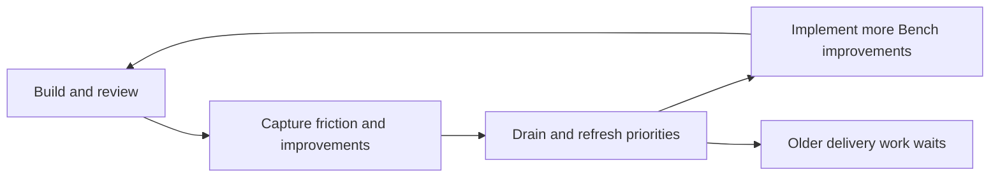

# Roadmap focus and completion diagnosis

Protect a small delivery commitment before another roadmap cleanup. Admit new work only when it serves that commitment or replaces named committed work.

Scope: roadmap growth, priority continuity, closure, and project completion
Evidence status: verified repository history and source inspection; causal conclusions remain inferences
Source repository: /home/mgibs/workspace/bench
Source branch: main
Source commit: d0d99dc97ef03c8dc57c28eac6071e4741d87432
Retrieved: 2026-10-04
Consumed by: the reviewer's decision about Bench intake and delivery policy
Drift: refresh when the roadmap, drain rules, final-check rules, or flow implementation changes
Retire when: an approved delivery policy replaces this diagnosis and validates its predictions

This report changes no roadmap row, priority, implementation, or operating rule. It proposes no new feature row.

## Question graph

1. Does the roadmap grow despite completed work and earlier cleanup?
2. What permits new work to displace earlier priorities?
3. What produces additional work, and what limits admission?
4. Do closure and release criteria control the active queue?
5. What minimum policy change would make delivery converge?

Questions 1 through 4 constrain the proposal in question 5. The report separates observed facts, causal inferences, and proposed changes.

## 1. Does the roadmap grow despite completed work?

### Tested results

The coordinator counted unique `FT` headings in committed roadmap snapshots. The weekly event count compares successive first-parent snapshots, so merge parents do not duplicate events.

| Observation | Result | Exact evidence |
| --- | --- | --- |
| Previous cleanup | 82 rows became 69 | `673ebcf8:ROADMAP.md` and `4ee3c625:ROADMAP.md`, September 25 |
| Current board | 91 rows | `d0d99dc9:ROADMAP.md` |
| September 27 through October 3 | 29 row additions; 12 row removals; net increase of 17 | First-parent roadmap changes after `08dcd853` through `d0d99dc9` |
| Weekly endpoint count | 74 rows became 91 | `08dcd853:ROADMAP.md` and `d0d99dc9:ROADMAP.md` |
| September 30 survey drain | 14 additions; no removals | `3b37ad42:ROADMAP.md` compared with its previous first-parent board |

Row removal can mean delivery, consolidation, or dismissal. These counts do not equate removal with shipped behavior or measure implementation effort.

The reviewer identifies the deepening assessment as the source of several new rows. The September 30 survey batch accounts for fourteen additions.
Those findings can be valid. Their discovery does not establish that they must replace the current delivery commitment.
Growth alone therefore does not prove a prioritization failure. The diagnosis depends on the selection and commitment rules below.

The earlier assessment explicitly proposed consolidation and promoted ready work. Its recorded application reduced the board to 69 rows.
Source: [previous assessment](roadmap-review-2026-09-25.md:16), with both historical counts independently checked.

The live reproduction command is:

```text
/home/mgibs/workspace/bench/bin/bench.sh roadmap --flow
opened=22 fed=41 retired=7 net=15 open_mass=91 target_met=false drains=3
window_from=6b5b1996834a8a1c4ca2a7abc03f1b49e292597d
window_to=4dd5e1784c30117255b3423396e927b5ebfa06e8
exit=0
```

The coordinator ran this command twice and observed the same result. It demonstrates the growth signal through the actual command.

The flow window ends after three commits that add detail files. It does not mean three consecutive drain invocations or a fixed calendar period.
The `fed` count measures detail-file modifications. It does not prove 41 scope expansions.
Sources: [window selection](../../internal/roadmapflow/flow.go:130) and [event counts](../../internal/roadmapflow/flow.go:100).

### Inference

Periodic consolidation does not control the rate of new work. The board regrows because the process that admits and prioritizes work remains active after cleanup.

## 2. What permits priority displacement?

### Facts

Every drain rewrites the recommended sequence. Its ordered criteria are severity, actionability, dependencies, reviewer pricing, occurrence count, defect status, and cost.
The rule contains no term for an existing commitment, time already spent waiting, or distance to the selected milestone.
Source: [sequence policy](../../.agents/commands/bench-drain.md:242).

The September 25 review promoted FT290 near the top of ready work. The current board places eleven reviewer-priority rows before its delivery queue.
FT290 remains the first row in that lower queue.
Sources: [earlier proposal](roadmap-review-2026-09-25.md:145), [current priority section](../../ROADMAP.md:16), and [FT290](../../ROADMAP.md:45).

FT215 was second in the sequence at `5746d930:ROADMAP.md`. It remains open outside the current recommended sequence.
The earlier FT336 and FT337 priorities did retire in commits `1952c9ce` and `e695abf9`. Commit `5746d930` also removed delivered FT115 and FT338.
Sources: the named commits' `ROADMAP.md` diffs, independently read by the coordinator.

Commit `c9a9f4e0` created the reviewer-priority section and placed FT373 second on October 3. Commit `4dd5e178` preserved that order.
Both commits attribute priority decisions to the reviewer. This diagnosis did not inspect the original conversations and cannot verify those attributions independently.
Sources: the commit bodies and their `ROADMAP.md` diffs; [current sequence](../../ROADMAP.md:292).

### Inference

A recommendation is a fresh preference, not a protected delivery commitment. A new actionable improvement can repeatedly pass older work that still needs a decision.

The workflow distinguishes parked work and ready work, but it does not require a separate commitment decision before changing the recommended sequence.
Evidence that an issue exists, evidence that it deserves eventual work, and evidence that it should interrupt delivery answer different questions.
An assessment can establish the first two without establishing the third.

The agent can justify each promotion locally while the project loses continuity. Batch approval leaves the reviewer to detect the cumulative displacement.
The recorded reviewer attribution does not establish that the process makes each displaced outcome and its cost visible.

## 3. What produces additional work?

### Facts

Final-check requires a rule learning whenever a landing records raw calls. It also requires an implementation retrospective with proposed CLI, skill, and process improvements.
Source: [capture duties](../../.agents/commands/bench-final-check.md:74) and [retro duties](../../.agents/commands/bench-final-check.md:100).

The drain must dispose of every idea, retrospective recommendation, and learning. Work-shaped and rule-shaped learnings become roadmap items unless another disposition closes them.
Sources: [idea intake](../../.agents/commands/bench-drain.md:141) and [journal intake](../../.agents/commands/bench-drain.md:191).

The workflow has real limits. It permits dismissal, consolidation, re-parking, and direct completion of small fixes. An occurrence alone does not justify feeding a row.
Sources: [occurrence threshold](../../.agents/commands/bench-drain.md:117) and [direct completion](../../.agents/commands/bench-drain.md:203).

Kit synthesis also treats growth as a cost and rejects settled or redundant proposals. That rule does not reserve delivery capacity for an existing milestone.
Source: [synthesis discipline](../../.agents/skills/bench-craft-synthesis/SKILL.md:13).

### Inference

Bench has a recurring source of improvement candidates but no corresponding board-level admission budget in the inspected rules.
Each useful process improvement can appear justified without proving that it is worth delaying the existing delivery plan.

Directly implementing every small improvement can reduce row growth while still consuming delivery time. A smaller board alone would not prove restored focus.



This feedback loop is useful for maintenance. Without a protected delivery commitment, it can keep Bench improving itself indefinitely.

## 4. Do closure and finish criteria control the queue?

### Facts

Bench protects completion within an approved build through serial checkpoints, review, acceptance reconciliation, and a whole-project gate.
Source: [build boundaries](../../.bench/BENCH.md:121).

Roadmap closure belongs to a later drain. Final-check explicitly leaves roadmap rows to that phase even after the spec retires.
Source: [split closure ownership](../../.agents/commands/bench-final-check.md:84).

The live command `bench spec history ft370-comment-only-evidence` reports retirement commits `0cc5bc21` and `6fa42c8d` on October 3.
The first is the landing merge of the second. They describe one retirement.
Yet the current sequence still recommends the deleted FT370 spec.
Source: [stale sequence](../../ROADMAP.md:294) and both retirement commits.

The roadmap does state release criteria and a qualified adoption milestone. FT306 names a user-visible Regroup change and depends on durable execution, FT305.
Sources: [release criteria](../../ROADMAP.md:227), [dependency](../../ROADMAP.md:274), and [FT306](../../roadmap/FT306.md:1).

The sequence policy does not require each selected row to close one of those criteria. It does not require a milestone link for admission.
Source: [selection criteria](../../.agents/commands/bench-drain.md:242).

The flow command reports a missed target and returns success. Its tests explicitly require success for positive net growth.
Sources: [flow result](../../internal/roadmapflow/flow.go:171) and [positive-growth test](../../internal/roadmapflow/flow_test.go:204).

The drain must propose reductions after positive growth. A general restructuring pass is optional, and the proposal requirement does not impose a size limit.
Source: [contraction policy](../../.agents/commands/bench-drain.md:225).

### Inference

Bench enforces the correctness of completed changes more strongly than progress toward a finite project outcome.
The finish criteria exist, but they do not govern intake or protect the sequence that reaches them.

Stale rows further reduce trust. They mix completed work with real residual work and can send the next session to a deleted spec.

## 5. What minimum change would support completion?

### Proposal

Use a finite delivery commitment rather than another broad improvement program. These are decision principles, not adopted rules or new roadmap items.

| Decision | Proposed behavior | Consequence |
| --- | --- | --- |
| Define the current finish | Select one observable milestone and its necessary existing rows. | Optional quality work stays outside the milestone. The existing FT306 outcome is one candidate. |
| Protect the next work | Keep one active outcome and a short fixed successor list. | A drain cannot silently replace the next item. A reviewer override names the displaced item and reason. |
| Separate capture from admission | Retain useful observations without automatically scheduling them. | Only a demonstrated blocker or an explicit trade displaces committed work. |
| Close complete outcomes | Retire a delivered row and its sequence reference as part of closure. | New sessions see the actual remaining work. Existing guarantees remain intact. |
| Measure delivery progress | Track remaining milestone obligations, completed committed outcomes, and interruptions. | Row consolidation alone cannot masquerade as delivery. |

These proposals address the gaps in questions 2 through 4. They do not require another scheduler, scoring framework, or measurement platform.

An emergency exception needs a concrete effect on safety, data preservation, or the current milestone. General future savings are insufficient by themselves.
The reviewer still owns scope and priority changes.

## Contradictions and limits

- The history includes real deliveries. Growth does not mean that every earlier priority was abandoned.
- The flow target is a diagnostic signal, although its name can suggest a gate.
- The report verifies recorded reviewer attributions, not the original conversations.
- The 91 rows include decisions, deferred capabilities, and parked work. They are not 91 active implementations.
- Row counts do not measure effort, elapsed delivery time, business value, or savings from process improvements.
- Source inspection supports the mechanism, but this diagnosis ran no controlled trial of an alternative policy.
- The reviewer has not selected a new finite milestone or approved these policy changes.

## Verification record

- [x] Pin the source and independently count historical board rows.
- [x] Run the real flow command twice and retain its target result.
- [x] Check the flow implementation and distinguish events from calendar periods.
- [x] Re-open the sources behind both read-only research returns.
- [x] Confirm the primary checkout remains clean at the pinned source.
- [x] Separate facts, inferences, unknowns, and proposals.
- [x] Pass the report's prose check.
- [ ] Complete a delivery trial under an approved commitment rule.

The policy consultation used `gpt-5.6-sol` at high effort. The history consultation used the same line.
Neither delegate changed repository files or ran product tests. The coordinator verified the cited policy sources and historical counts.

No implementation fix or full project gate ran. The current flow signal remains false.

## Validation plan

1. Agree on a finite milestone and the existing rows required to reach it.
2. Record the active outcome and its fixed successors.
3. Process the next capture batch without displacing that commitment.
4. Record each exception with its blocker evidence and displaced outcome.
5. Finish the active outcome and remove its stale roadmap references.
6. Compare completed commitments and remaining milestone obligations after the trial.

Success means the agreed delivery work finishes while unrelated discoveries remain deferred. A cleaner document alone does not meet that condition.
